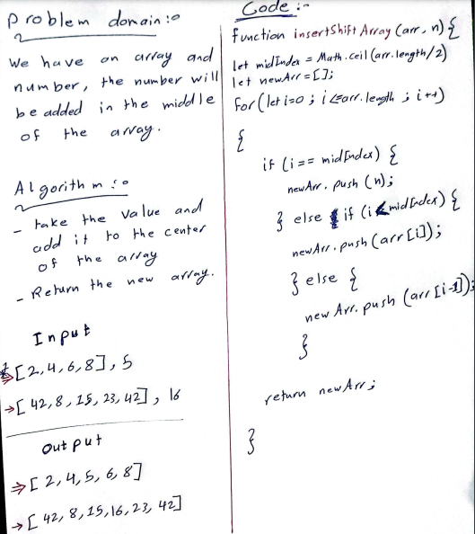

# Class 02 

## part 1: Adding a number in the middle of the array

### You can see the TEST result of the code challenge here : [Replit Code LINK](https://replit.com/@mohammadaljamal/add-number-in-the-middle-of-array-javascript#index.js)

