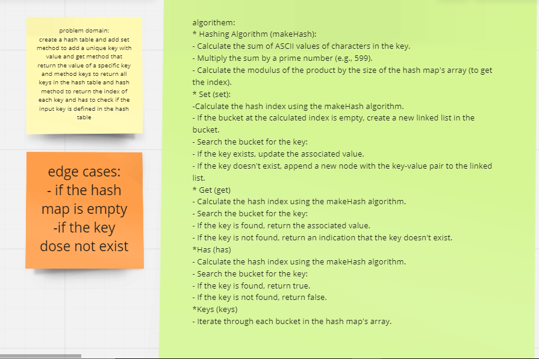
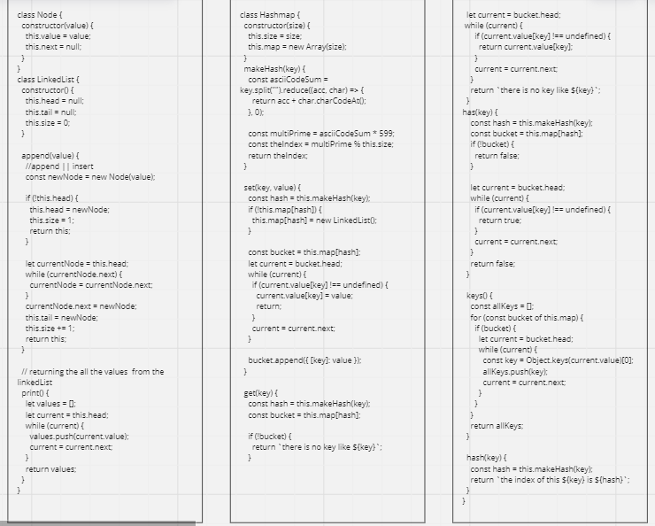

# Class 30  

## HahMap repeated Word

### You can see the code of the challenge here: [Hash Table repeatedWord](./hashtable/hashtable.js)

### You can see the code Test of the challenge here: [Hashtable.TEST](./hashtable/__tests__/hashtable.test.js)

### [ pull request ](https://github.com/Mohammad-Aljamal/data-structures-and-algorithms/pull/39)
### [ pull request ](https://github.com/Mohammad-Aljamal/data-structures-and-algorithms/pull/40)

### 

### 

