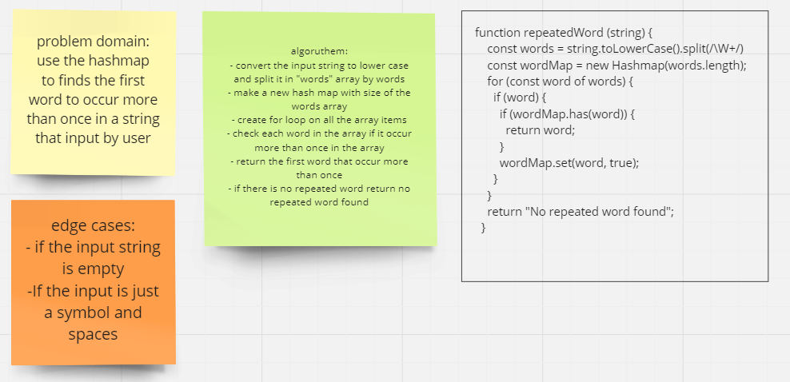

# Class 31

## HahMap 

### You can see the code of the challenge here: [Hash Table](./hashtable/hashtable.js)

### You can see the code Test of the challenge here: [Hashtable.TEST](./hashtable/__tests__/hashtable.test.js)

<!-- ### [ pull request ](https://github.com/Mohammad-Aljamal/data-structures-and-algorithms/pull/41) -->
<!-- ### [ pull request ](https://github.com/Mohammad-Aljamal/data-structures-and-algorithms/pull/42) -->
### [ pull request ](https://github.com/Mohammad-Aljamal/data-structures-and-algorithms/pull/44)
### [ pull request ](https://github.com/Mohammad-Aljamal/data-structures-and-algorithms/pull/47)

<!-- ###  -->
### 

