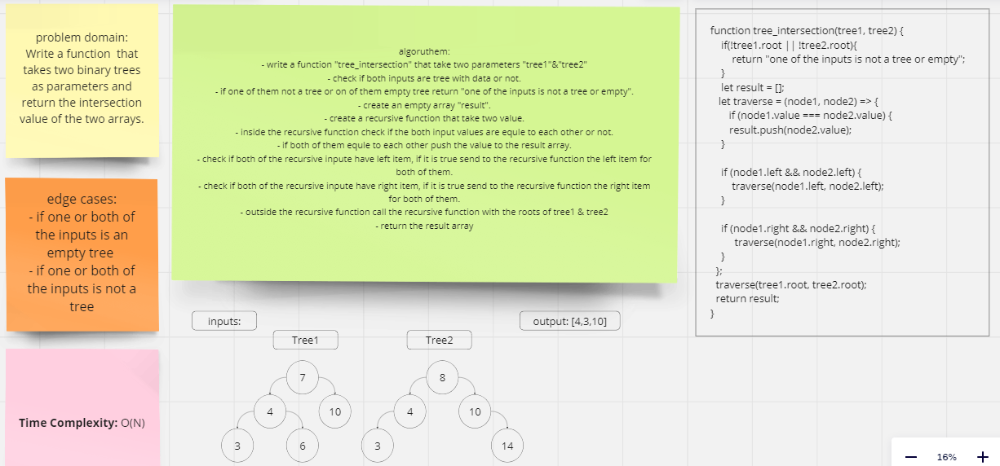

# Class 32

## tree_intersection:
return the same values in the same location of two tree

### You can see the code of the challenge here: [tree_intersection](./Tree/treeIntersection/tree-intersection.js)

### You can see the code Test of the challenge here: [tree_intersection TEST](./Tree/__test__/binary-search-tree.test.js)

### [ pull request ](https://github.com/Mohammad-Aljamal/data-structures-and-algorithms/pull/43)

### 

