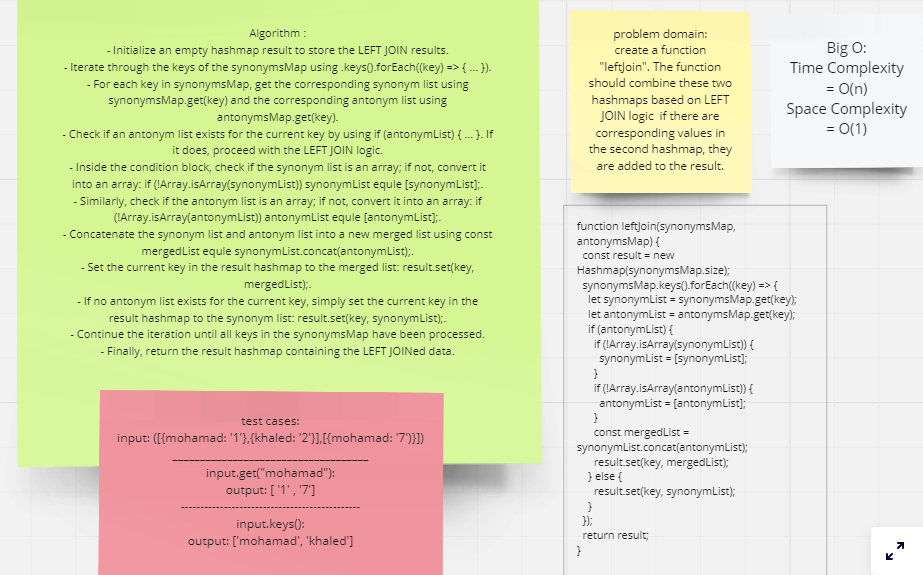

# Class 33

## HahMap-left-join

### You can see the code of the challenge here: [Hash Table left-join](./hashtable/hashtable.js)

### You can see the code Test of the challenge here: [Hashtable.TEST](./hashtable/__tests__/hashtable.test.js)

### [ pull request ](https://github.com/Mohammad-Aljamal/data-structures-and-algorithms/pull/52)

### 

